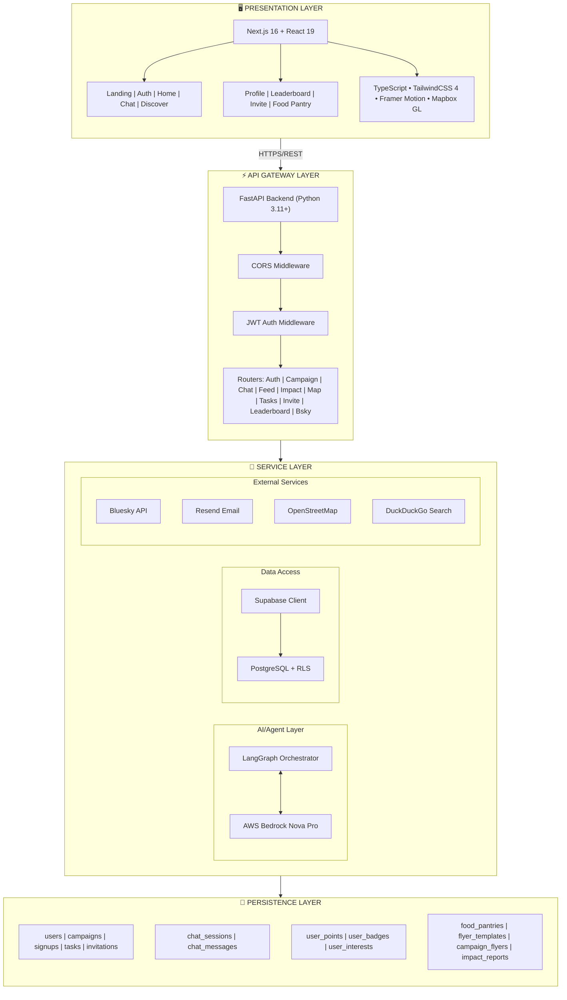
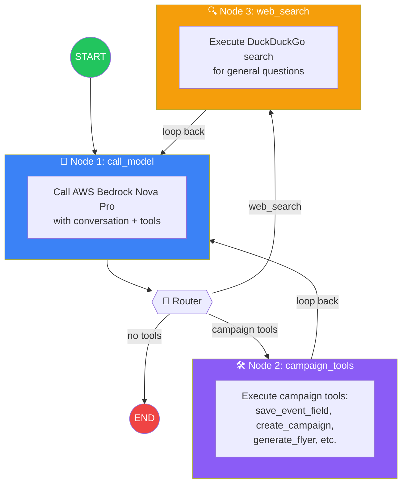
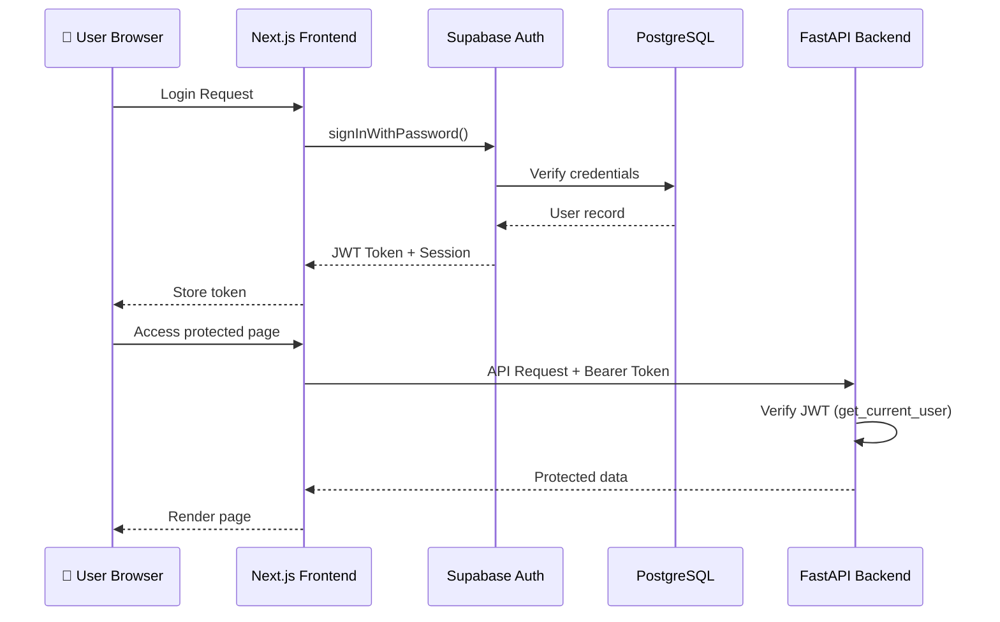
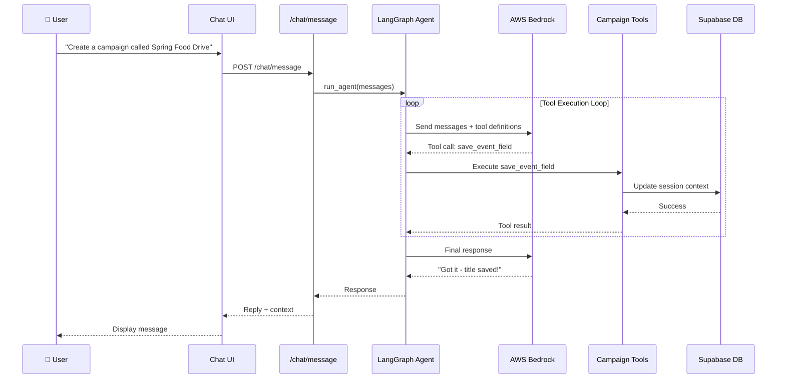
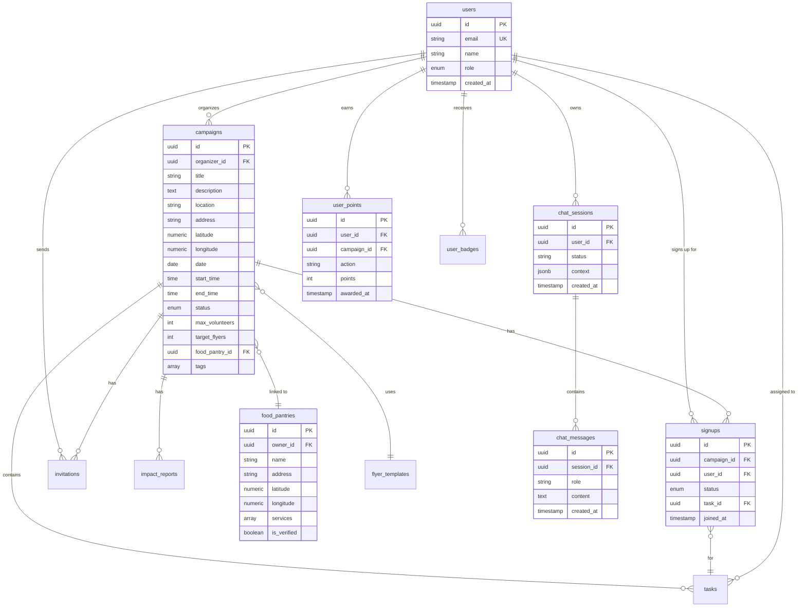
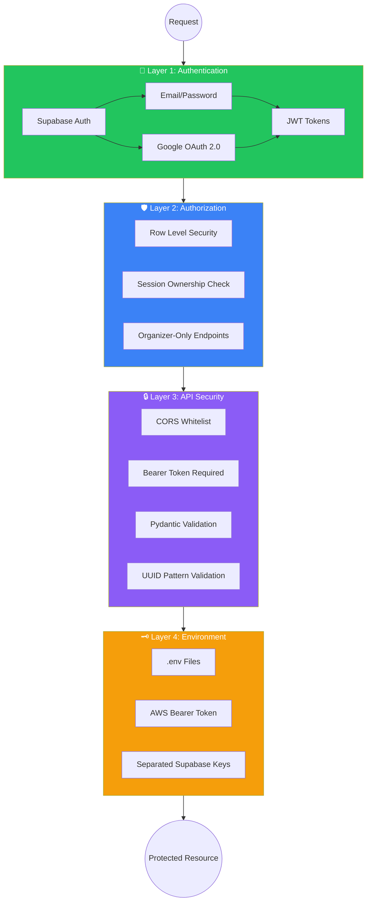
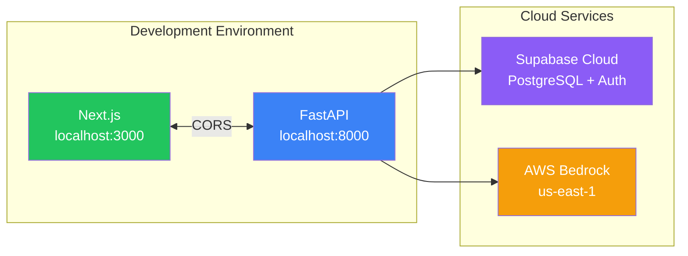

# TrackATeam4 - Technical Architecture Documentation

> **Note:** This document uses Mermaid diagrams which render automatically on GitHub.

---

## System Architecture Overview

---

## LangGraph Agent Architecture (3-Node Graph)

---

## User Authentication Flow

---

## AI Campaign Creation Flow

---

## Database Entity Relationship Diagram

---

## AI Tools Architecture

```mermaid
flowchart LR
    subgraph Collection["📝 Data Collection"]
        save["save_event_field"]
    end

    subgraph Validation["✅ Validation"]
        conflicts["check_conflicts"]
        pantries["suggest_nearby_pantries"]
    end

    subgraph Creation["🎯 Creation"]
        create["create_campaign"]
        flyer["generate_flyer"]
    end

    subgraph Social["📢 Social"]
        bsky["post_campaign_to_bluesky"]
    end

    subgraph Communication["📧 Communication"]
        invite["send_campaign_invite"]
        bulk["send_bulk_invites"]
        list["list_campaign_invitations"]
    end

    subgraph Utility["🔧 Utility"]
        reset["reset_session"]
        calendar["get_campaign_calendar_url"]
        signups["get_campaign_signups"]
    end

    User((User)) --> Collection
    Collection --> Validation
    Validation --> Creation
    Creation --> Social
    Creation --> Communication
    Social --> Utility

    style Collection fill:#22c55e,color:#fff
    style Validation fill:#3b82f6,color:#fff
    style Creation fill:#8b5cf6,color:#fff
    style Social fill:#ec4899,color:#fff
    style Communication fill:#f59e0b,color:#fff
    style Utility fill:#6b7280,color:#fff
```

---

## Security Architecture

---

## Technical Stack Summary

| Layer | Technology | Version | Purpose |
|-------|------------|---------|---------|
| **Frontend** | Next.js | 16.1.6 | React framework with SSR/SSG |
| | React | 19.2.3 | UI component library |
| | TypeScript | 5.x | Type-safe JavaScript |
| | TailwindCSS | 4.x | Utility-first CSS |
| | Framer Motion | 12.36.0 | Animations |
| | Mapbox GL | 3.20.0 | Interactive maps |
| **Backend** | FastAPI | 0.135.1 | Async Python web framework |
| | Uvicorn | 0.41.0 | ASGI server |
| | Pydantic | 2.11.7+ | Data validation |
| **AI/ML** | LangGraph | 0.6.7 | Agent orchestration |
| | LangChain | 0.3.27 | LLM framework |
| | LangChain-AWS | 0.2.35 | Bedrock integration |
| | AWS Bedrock | - | Nova Pro v1 LLM |
| **Database** | Supabase | 2.28.2 | PostgreSQL + Auth + Storage |
| **External** | Resend | 2.0.0+ | Transactional email |
| | AT Protocol | 0.0.65 | Bluesky social posting |
| | FPDF2 | 2.8.3 | PDF flyer generation |

---

## API Endpoint Summary

### Public Endpoints
| Method | Endpoint | Description |
|--------|----------|-------------|
| GET | `/` | API status |
| GET | `/health` | Health check |
| GET | `/campaigns` | List all campaigns |
| GET | `/campaigns/{id}` | Get campaign details |
| GET | `/campaigns/geocode` | Geocode address |
| GET | `/map/food-pantries` | List food pantries |

### Protected Endpoints (Require Auth)
| Method | Endpoint | Description |
|--------|----------|-------------|
| POST | `/auth/signup` | Register new user |
| POST | `/auth/signin` | Login user |
| GET | `/auth/me` | Get current user |
| POST | `/campaigns` | Create campaign |
| PUT | `/campaigns/{id}` | Update campaign |
| DELETE | `/campaigns/{id}` | Cancel campaign |
| POST | `/campaigns/{id}/signup` | Volunteer signup |
| POST | `/chat/session` | Create chat session |
| POST | `/chat/message` | Send message to AI |
| GET | `/leaderboard` | Get points leaderboard |
| POST | `/bsky/post` | Post to Bluesky |

---

## Available AI Tools (12 Tools)

| Tool | Purpose | When Called |
|------|---------|-------------|
| `save_event_field` | Save campaign field to session | User provides event details |
| `check_conflicts` | Find scheduling conflicts | Before campaign creation |
| `suggest_nearby_pantries` | Find food pantries within 5km | After location is set |
| `create_campaign` | Create campaign from context | All required fields collected |
| `generate_flyer` | Generate PDF flyer | After campaign creation |
| `post_campaign_to_bluesky` | Post to Bluesky social | After campaign creation |
| `reset_session` | Clear session for new campaign | User wants to start fresh |
| `send_campaign_invite` | Email single volunteer | User requests invite |
| `send_bulk_invites` | Email multiple volunteers | User provides email list |
| `list_campaign_invitations` | Show invitation status | User asks about invites |
| `get_campaign_calendar_url` | Generate Google Calendar link | User requests calendar |
| `get_campaign_signups` | List volunteer signups | User asks about signups |

---

## Deployment Architecture

---

## Performance Considerations

| Component | Strategy |
|-----------|----------|
| **Database** | PostgreSQL indexes on foreign keys, pagination on list endpoints |
| **API** | Async FastAPI handlers, connection pooling via Supabase |
| **AI** | 120s timeout for Bedrock calls, max 8 tool iterations per turn |
| **Frontend** | Next.js SSR/SSG, TailwindCSS for minimal CSS bundle |
| **Chat** | Session history capped at 10 messages to reduce token usage |

---

*Document generated for TrackATeam4 mentor review and judge Q&A preparation.*
